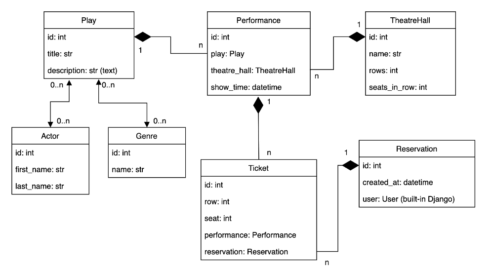
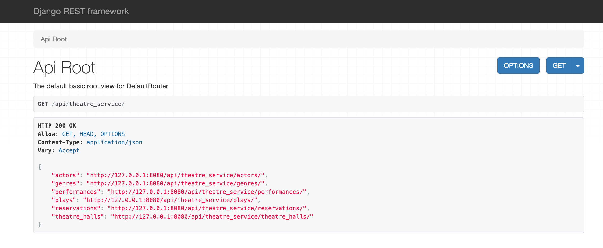
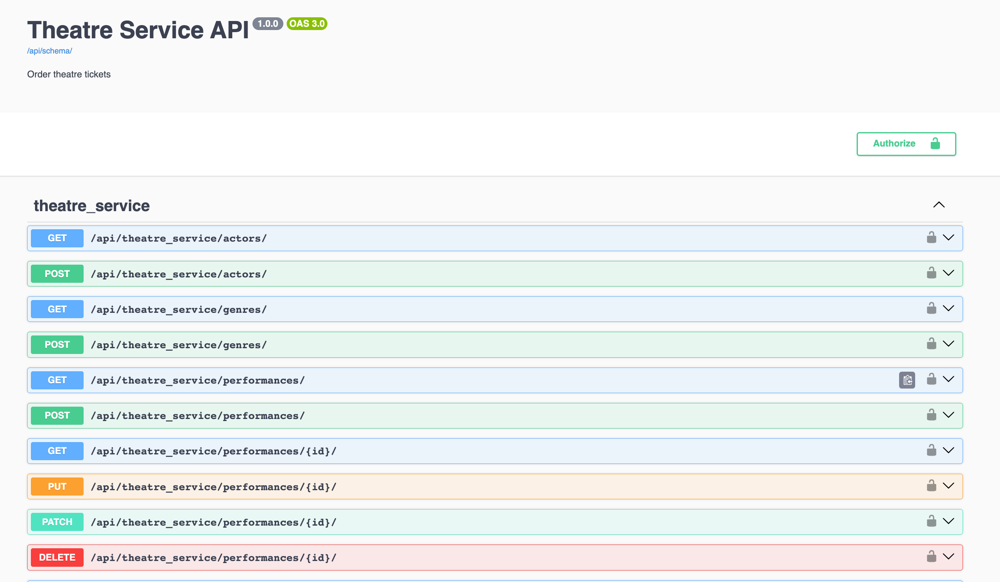
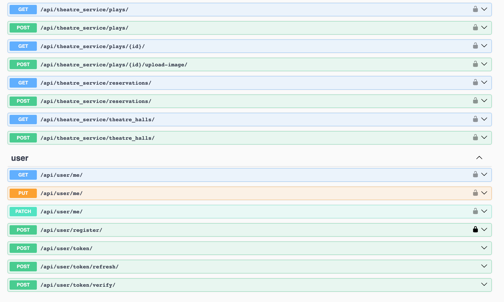

# Theatre Service API Service

The Theater API Service is a Django-based RESTful API for managing plays, performances, actors, and more in the theater service. It offers endpoints for creation, updating and retrieval of theater-related data, as well as user registration and order management.

### Features:

* Creating plays with genres and actors
* Ability to add an image to plays
* Creating theatre halls
* Creating performances with show time, play and theatre hall
* Filtering plays and performances
* Managing reservations and tickets
* Ticket validation based on cargo and seat availability.
* JWT authentication for users.
* Documentation is located at: </api/doc/swagger/>, </api/doc/redoc/>


## How to launch locally:

1. Clone the repository:

   ```
   git clone https://github.com/PodorogaNatalia/theatre-api-service.git
   ```

2. Navigate to the project directory:

   ```
   cd theatre-api-service
   ```

3. Create and activate a virtual environment:

   ```
   python -m venv venv
   
   source venv/bin/activate # For Mac OS/Linux
   
   venv\Scripts\activate  # For Windows
   ```

4. Install the required dependencies:

   ```
   pip install -r requirements.txt
   ```

5. Create .env file and define environmental variables following .env.sample


6. Install PostgreSQL and create a data base


7. Run the database migrations:

   ```
   python manage.py migrate
   ```

8. Run the development server:

   ```
   python manage.py runserver
   ```
   

## How to launch with docker:

1. Clone the repository:

   ```
   git clone https://github.com/PodorogaNatalia/theatre-api-service.git
   ```
   
2. Create .env file and define environmental variables following .env.sample


3. Install Docker on your machine.

   
4. Run command:

   ```
   docker-compose up --build
   ```
   
5. You should use such localhost for you app: ```127.0.0.1:8000```


## Service has next endpoints:
   ```
   "theatre" : 
                "http://127.0.0.1:8000/api/theatre/genres/"
                "http://127.0.0.1:8000/api/theatre/actors/"
                "http://127.0.0.1:8000/api/theatre/plays/"
                "http://127.0.0.1:8000/api/theatre/theatre_halls/"
                "http://127.0.0.1:8000/api/theatre/performances/"
                "http://127.0.0.1:8000/api/theatre/reservations/"
   "user" : 
                   "http://127.0.0.1:8000/api/user/register/"
                   "http://127.0.0.1:8000/api/user/me/"
                   "http://127.0.0.1:8000/api/user/token/"
                   "http://127.0.0.1:8000/api/user/token/refresh/"
   "documentation": 
                   "http://127.0.0.1:8000/api/doc/"
                   "http://127.0.0.1:8000/api/swagger/"
                   "http://127.0.0.1:8000/api/redoc/"
   ```

## Schema



## Screenshots of the project





